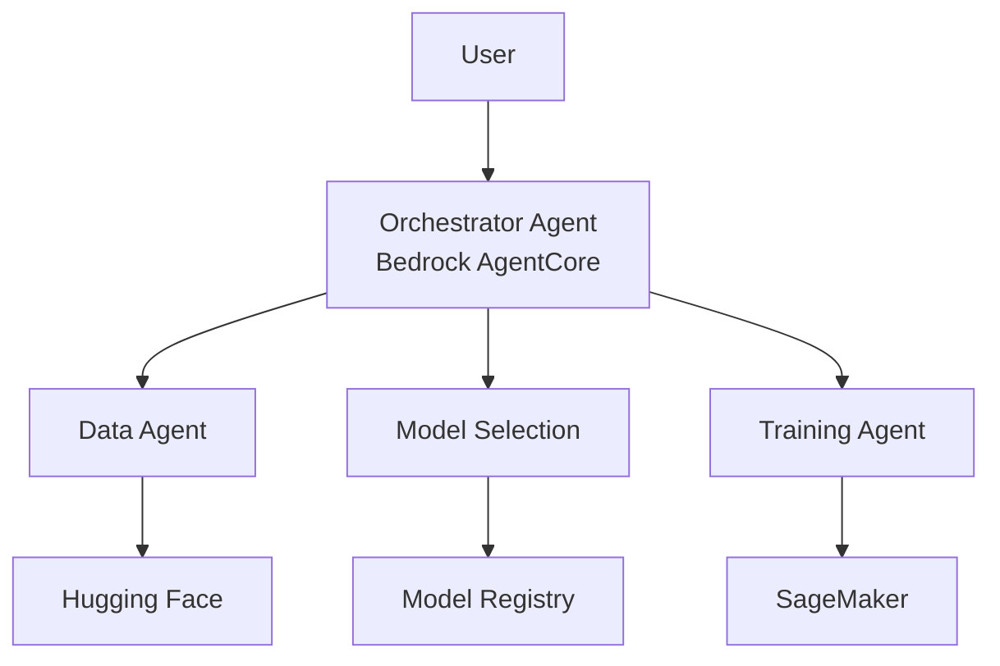

# AgenticAIOps

> Hybrid-Cloud MLOps Automation Platform with AI Agents

[](https://awsaiagent.devpost.com/)
[]()
[]()

## Demo

🎥 **[Watch Demo Video](https://youtu.be/1HAbBfErWrU)** - See the platform in action!


## Overview

LLMOps Agent is an AI-powered MLOps platform that autonomously handles the complete ML lifecycle:
- 🤖 **Intelligent model selection** based on constraints (budget, time, performance)
- 📊 **Automated dataset discovery** from Hugging Face (100k+ datasets)
- 💰 **Cost-optimized training** Demo with SageMaker + LoRA
- 🔄 **Hybrid cloud design** (AWS now, on-prem later)

### Hackathon Use Case (Example): NER Training

**User Input:**
> "Train a Named Entity Recognition model on the ciER dataset. Budget: $10, Time: 1 hour, F1 score > 85%"

**Agent Output (42 minutes later):**
> ✅ Training complete! Model: `ner-ciER-distilbert-v1`  
> 📊 F1: 87.3%, Precision: 88%, Recall: 86%  
> 💰 Cost: $4.20 (budget: $10.00)  
> ⏱️ Time: 42 min (limit: 60 min)

## Architecture



## Quick Start

### Prerequisites

- Python 3.11 or 3.12
- [Poetry](https://python-poetry.org/) for dependency management
- Node.js 18+ (for frontend)
- AWS account with credits

### 1. Clone Repository
```bash
git clone https://github.com/your-org/AgenticAIOps.git
cd AgenticAIOps
```

### 2. Configure Environment
```bash
# Copy environment template
cp .env.example .env

# Edit .env with your AWS credentials
# (See ENV_SETUP_COMPLETE.md for details)
```

### 3. Install Dependencies

**Backend:**
```bash
# Install all dependencies (includes dev, docs, jupyter)
poetry install

# Or install only production dependencies
poetry install --only main
```

**Frontend:**
```bash
cd frontend
npm install
cd ..
```

### 4. Activate Environment & Verify Setup
```bash
# Activate Poetry shell
poetry shell

# Verify environment configuration
poetry run llmops verify

# Or run directly
python -m llmops_agent.scripts.verify_env
```

### 5. Setup AWS Infrastructure
Follow the detailed guide: **[AWS Setup Instructions](docs/setup/aws-setup.md)**

Quick checklist:
- [ ] Apply $100 AWS credits
- [ ] Enable Bedrock (Claude 3.5 Sonnet)
- [ ] Create S3 buckets
- [ ] Create DynamoDB tables
- [ ] Configure IAM roles

### 6. Run Services

**Backend API:**
```bash
# Start the FastAPI backend server on port 8003
poetry run uvicorn llmops_agent.api.main:app --reload --host 0.0.0.0 --port 8003
# Visit http://localhost:8003
# API Docs: http://localhost:8003/docs
```

**Frontend:**
```bash
cd frontend
npm run dev
# Visit http://localhost:3000
```

**Documentation Server (optional):**
```bash
poetry run mkdocs serve
# Visit http://localhost:8001
```

### 7. Development Workflow

```bash
# Run tests
poetry run pytest

# Format code
poetry run black src/ tests/

# Type checking
poetry run mypy src/

# View available commands
poetry run llmops --help
```

## Poetry Management

For detailed Poetry usage, see **[POETRY_SETUP.md](POETRY_SETUP.md)**

**Common commands:**
```bash
# Add a dependency
poetry add package-name

# Add a dev dependency
poetry add --group dev package-name

# Update dependencies
poetry update

# Show installed packages
poetry show

# Export requirements.txt (for compatibility)
poetry export -f requirements.txt --output requirements.txt
```


## Project Structure

```
AgenticAIOps/
├── src/
│   └── llmops_agent/          # Main Python package
│       ├── api/               # FastAPI application
│       ├── agents/            # Agent implementations
│       ├── core/              # Core utilities
│       ├── models/            # Data models
│       ├── services/          # Business logic
│       ├── cli.py             # CLI commands
│       └── config.py          # Configuration management
├── tests/                     # Test suite
│   ├── unit/                  # Unit tests
│   └── integration/           # Integration tests
├── frontend/                  # Next.js frontend
│   ├── app/                   # Pages (chat, jobs, models, metrics)
│   ├── components/            # React components
│   ├── hooks/                 # Custom hooks
│   └── scripts/               # Config sync scripts
├── scripts/                   # Backend utility scripts
│   ├── setup_bedrock_agent.sh
│   ├── sync-ui-config.js
│   └── training/              # Training scripts
├── lambda/                    # AWS Lambda functions
├── pyproject.toml             # Poetry configuration
├── poetry.lock                # Locked dependencies
├── .env                       # Environment variables (not committed)
└── .env.example               # Environment template
```

## Technology Stack

**Frontend:** Next.js 14, TypeScript, Tailwind CSS, Radix UI
**Backend:** FastAPI, Python 3.12, Poetry, Uvicorn
**Agents:** Amazon Bedrock AgentCore, Claude 3.5 Sonnet, LangGraph
**ML:** Hugging Face Transformers, PEFT (LoRA), SageMaker, PyTorch
**MLOps:** MLflow, S3, DynamoDB
**Monitoring:** CloudWatch, Structured Logging
**Package Management:** Poetry, npm

## Hackathon Details

**Event:** AWS AI Agent Global Hackathon  
**Deadline:** October 22, 2025  
**Submission:** Working POC + 3-min demo video

## Roadmap

- [x] Frontend UI (Next.js)
- [x] Architecture design
- [x] Documentation setup
- [x] Backend implementation (FastAPI)
- [x] Bedrock AgentCore integration
- [x] SageMaker training pipeline
- [x] End-to-end training automation
- [x] Demo video ([Watch here](https://youtu.be/1HAbBfErWrU))
- [ ] Frontend Local Setup & Testing Support
- [ ] Backend Local Setup & Testing Support
- [ ] OnPrem MLOps Support
- [ ] Multiagentic MLOps Improvements
- [ ] Multimodal AIOps Improvements


## Contributing

Currently in hackathon mode. Contributions welcome reachout to the authors. 

## License

MIT (to be finalized)

## Contact

**Developer:** Sri Chakra, Manu Chandran   
**Hackathon:** AWS AI Agent Global Hackathon 2025
